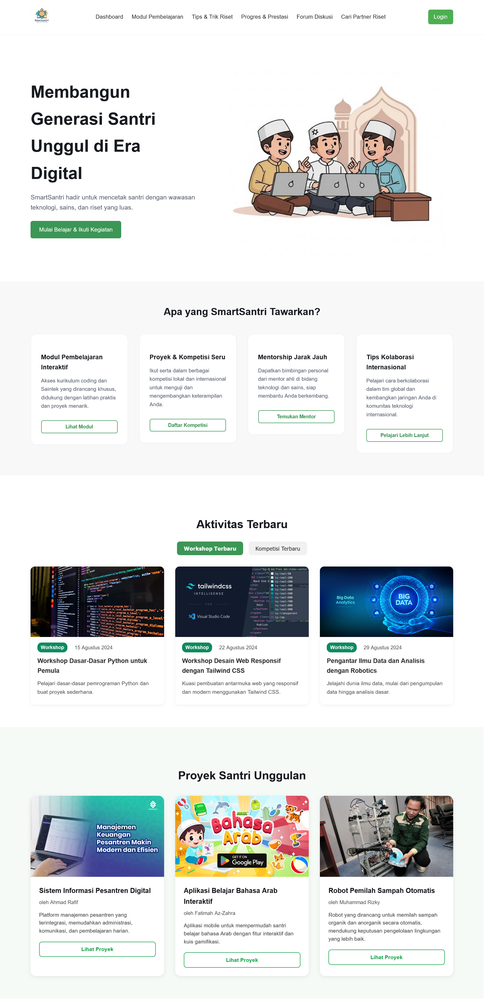

# SmartSantri – Digital Learning & Innovation Platform



SmartSantri is a web-based digital education platform designed to empower students (santri) with technology, research, and innovation skills.

It provides structured learning modules, competitions, mentorship programs, discussion forums, and progress tracking in one integrated system.

---

## 🌟 Vision

To build a generation of digitally skilled and research-oriented santri who are ready to compete in the modern technological era.

---

## 🚀 Key Features

### 📚 Interactive Learning Modules
Access structured programming and research materials supported by practical exercises.

### 🏆 Projects & Competitions
Participate in local and international competitions to enhance technical skills.

### 👨‍🏫 Online Mentorship
Connect with mentors in science and technology fields.

### 💬 Discussion Forum
Share ideas, collaborate, and grow with fellow students.

### 📊 Progress & Achievement Tracking
Monitor learning progress and personal development.

---

## 🖥️ Homepage Overview

The homepage introduces SmartSantri’s mission:

> “Building a Generation of Excellent Santri in the Digital Era.”

Users can:
- Start learning modules
- Join workshops
- Explore competitions
- Find research partners
- Access discussion forums

---

## 📅 Latest Activities

Includes:
- Python Programming Workshop
- Responsive Web Design Workshop
- Introduction to Data Science & Robotics

---

## 🏆 Featured Student Projects

SmartSantri highlights innovative student projects such as:

- Digital Islamic Boarding School Information System
- Interactive Arabic Learning Application
- Automatic Waste Sorting Robot

---

## 🛠️ Technology Stack

- HTML
- CSS
- PHP (Native)
- MySQL
- XAMPP (Local Development)

---

## ⚙️ Installation Guide

```bash
git clone https://github.com/nidaintech/SmartSantri.git
